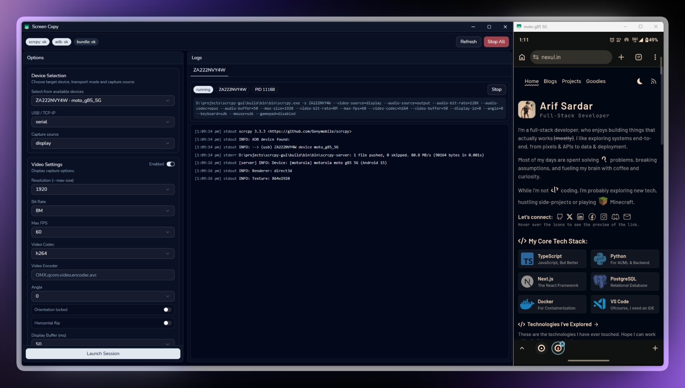

# scrcpy-gui

Desktop GUI for [scrcpy](https://github.com/Genymobile/scrcpy), built with Wails (Go backend + React frontend), with Windows and Linux runtime support.



This app focuses on a practical workflow:
- detect `scrcpy` + `adb`
- verify bundled runtime files
- select device/connection mode
- launch one or more scrcpy sessions
- stream live logs per running session

---

## Features

- **Environment checks** for `scrcpy` and `adb` paths
- **Bundle health checks** using `required-files.txt`
- **Device discovery** via `adb devices -l`
- **Multi-instance sessions** (start/stop individual or stop all)
- **Live stdout/stderr logs** with bounded in-memory history
- **Structured launch options** for display/camera/audio/window/input/recording/diagnostics
- **Platform-aware runtime bundle checks** for Windows and Linux
- **Windows packaging path** with bundled binaries and NSIS installer support

---

## Tech Stack

- **Backend:** Go 1.23 + Wails v2
- **Frontend:** React + TypeScript + Vite + Bun
- **Desktop shell:** Wails (frameless window)

---

## Prerequisites

Install these tools before development:

1. **Go 1.23+**
2. **Wails CLI v2**
3. **Bun** (used by this repo for frontend install/build in `wails.json`)
4. **Desktop runtime prerequisites**
	- Windows: WebView2 runtime (normally present on modern Windows; installer can bootstrap if needed)
	- Linux: GTK/WebKit dependencies required by Wails WebView

For device interaction:

- Android device with USB debugging enabled
- Appropriate USB drivers (if required by your device/vendor)

---

## Runtime Bundle (Required for Packaging)

The app is designed to ship `scrcpy` and `adb` with the build output/installer.

Put runtime files in:

- `bundle/<os>/bin/` (`<os>` is `windows` or `linux`)

Required baseline files:

- Windows: `scrcpy.exe`, `adb.exe`
- Linux: `scrcpy`, `adb`

Additional required files are defined in:

- `bundle/<os>/bin/required-files.txt`

Current manifest includes:

- `AdbWinApi.dll`
- `AdbWinUsbApi.dll`
- `SDL2.dll`

If required files are missing, launch is blocked with a bundle health error.

---

## Quick Start (Development)

From project root:

```powershell
wails dev
```

Wails will run frontend install/build/watch using Bun as configured in `wails.json`.

During first run, confirm:

- status badges show `scrcpy: ok`, `adb: ok`, `bundle: ok`
- at least one Android device appears in the device selector

---

## Building for Windows

Use the provided script to ensure bundled files are copied correctly.

### Standard app build

```powershell
./scripts/build-windows.ps1
```

### NSIS installer build

```powershell
./scripts/build-windows.ps1 -NSIS
```

## Building for Linux

Use the provided script to ensure Linux bundled files are copied correctly.

### Standard app build

```bash
./scripts/build-linux.sh
```

### Custom Linux platform build

```bash
./scripts/build-linux.sh --platform linux/arm64
```

## GitHub Actions Release (No Per-Commit Runs)

This repository includes a release workflow at [.github/workflows/release-windows.yml](.github/workflows/release-windows.yml).

It is intentionally configured to run only:

- on tag pushes matching `v*` (example: `v1.0.0`)
- when manually triggered from the Actions tab (`workflow_dispatch`)

It does **not** run on normal branch commits.

Workflow output:

- builds a Windows NSIS installer
- generates `SHA256SUMS.txt`
- uploads both as workflow artifacts
- publishes a GitHub Release automatically on tag builds

What the script does:

1. Validates `bundle/windows/bin/scrcpy.exe` and `bundle/windows/bin/adb.exe`
2. Runs `wails build --platform windows/amd64` (plus `--nsis` when requested)
3. Copies `bundle/windows/bin/*` to `build/bin/bin/`

Linux build script behavior (`scripts/build-linux.sh`):

1. Validates `bundle/linux/bin/scrcpy` and `bundle/linux/bin/adb`
2. Runs `wails build --platform linux/amd64` (or custom value from `--platform`)
3. Copies `bundle/linux/bin/*` to `build/bin/bin/`

Installer behavior (`build/windows/installer/project.nsi`):

- copies app files
- copies `bundle/windows/bin/*` into `$INSTDIR\\bin`

---

## How Executables Are Resolved

Backend executable discovery checks these locations first, then falls back to `PATH`:

1. Directory of the running executable
2. `<exe-dir>/bin`
3. `<exe-dir>/resources/bin`
4. Current working directory
5. `<cwd>/bin`
6. `<cwd>/build/bin`
7. `<cwd>/bundle/<runtime-os>/bin`
8. System `PATH`

At launch, the backend also prepends the resolved `adb` directory to `PATH` for the scrcpy process.

---

## Launch Options Coverage

The UI maps structured options to scrcpy CLI args. Main groups:

- **Device Selection**: serial / USB / TCP-IP, capture source (display/camera)
- **Video Settings**: max size, bitrate, fps, codec, encoder, orientation, display buffer/id
- **Camera Mode**: camera id/facing/size/fps/aspect/high-speed
- **Audio Settings**: source, bitrate, codec, encoder, buffer, duplication
- **Window Behavior**: title, fullscreen, always-on-top, borderless, position/size
- **Recording**: enable, format, time limit, no-playback, no-window
- **Input Control**: no-control, touches, stay-awake, screen behavior, keyboard/mouse/gamepad/otg
- **Display Features**: print fps
- **Diagnostics**: require-audio, no-downsize-on-error, extra args

The backend deduplicates repeated arguments while preserving order.

---

## App Events (Wails Runtime)

Frontend subscribes to these backend events:

- `environment:updated`
- `devices:updated`
- `instance:updated`
- `instance:log`

These drive live badge updates, device refresh, session tabs, and log streaming.

---

## Project Structure

Key paths:

- `main.go` – Wails app bootstrap
- `app.go` – backend state, process lifecycle, environment and bundle checks
- `launch_options.go` – typed launch options + argument builder
- `frontend/src/App.tsx` – main desktop UI shell
- `frontend/src/features/launch/` – launch option models and panel
- `bundle/windows/bin/` – bundled Windows runtime files
- `bundle/linux/bin/` – bundled Linux runtime files
- `scripts/build-windows.ps1` – repeatable Windows build script
- `scripts/build-linux.sh` – repeatable Linux build script
- `scrcpy-docs/` – local reference notes for scrcpy capabilities

---

## Troubleshooting

### `scrcpy: missing` or `adb: missing`

- Place binaries in `bundle/<runtime-os>/bin/` (for packaged flow), or
- ensure they are available in one of the discovery paths or system `PATH`
- click **Refresh** in app

### `bundle: issues`

- Open `bundle/<runtime-os>/bin/required-files.txt`
- add/correct required runtime files from your scrcpy distribution
- ensure files exist in `bundle/<runtime-os>/bin/`

### No devices found

- verify USB debugging is enabled on device
- run `adb devices -l` manually to validate connection
- check driver/authorization prompts on device

### Launch fails with argument errors

- reset unusual option combinations
- clear diagnostics/extra args
- verify selected capture source matches chosen settings

---

## Notes

- Current implementation supports runtime launch on **Windows and Linux**.
- The repository includes a generated `wailsjs` bridge for Go↔TS calls.
- Frontend package metadata requires a modern Node runtime, but this project uses **Bun** for Wails frontend tasks.

---

## Local Reference Docs

See `scrcpy-docs/` for topic-specific notes (audio, video, input, recording, etc.) used while shaping option support.

---

## License

This project is licensed under the MIT License. See [LICENSE](LICENSE).
